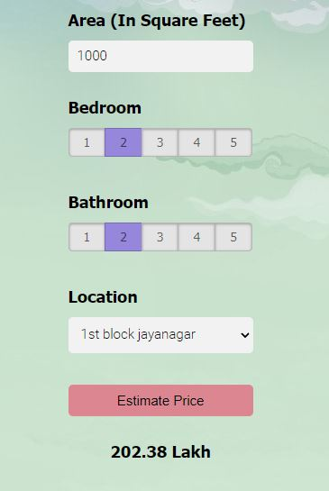

<h3>Banglore House Price Prediction</h3>

<h2>Introduction</h2>  
  Machine Learning project that estimates the price of the house based on the parameters like Area of the house in square feet, Total numbers of bedrooms and bathrooms in the house and the location of the house. The datasets for this project is taken from the kaggle and the model is used by comparing the different algorithms and deployed it through the Flask server.   

<h2>Datasets and Process to build the Model</h2>
  The datasets for this  project is taken from the kaggle which consists 13320 rows and 9 columns. Detailed explaination of data cleaning, feature engeering is in the above notebook. FOr building the model three algorithms namely Liner Regresssion, Lasso and Decision Tree is used  and among three algorithms Linear Regression performs well with the accuracy of 84% and is considered for building the model. 

<h2>Results</h2>
  Linear Regression model is saved in pickle file as well the Location features as there are about 244 unique locations and we have to fetch it when deploying in Flask server 

